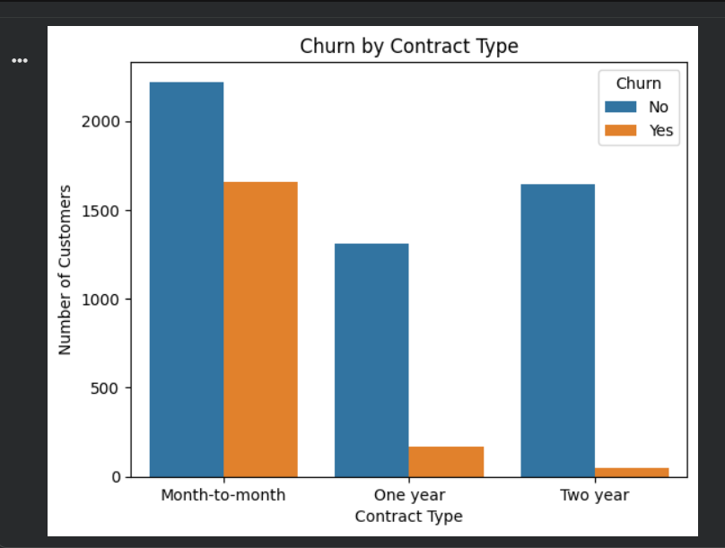
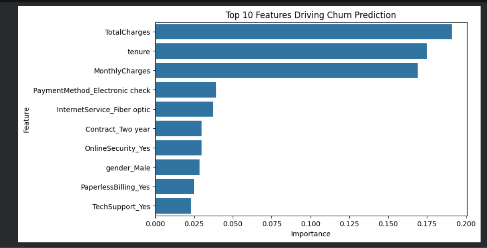

# Customer Churn Prediction — Data Analyst Portfolio Project
🔗 **Live Demo:** [Try the app here](https://customer-churn-prediction-eukqrwyceyylvgifqjoeqj.streamlit.app/)

## Problem Statement
Customer churn directly impacts revenue for subscription-based businesses. This project 
builds a classification model to predict which customers are likely to churn, enabling 
proactive retention efforts before they leave.

## Dataset
- **Source:** [Kaggle — Telco Customer Churn](https://www.kaggle.com/datasets/blastchar/telco-customer-churn)
- **Size:** 7,043 customers, 21 features
- **Target:** `Churn` (Yes/No)

## Approach
1. Data cleaning (fixed `TotalCharges` data type, handled blank values)
2. Exploratory Data Analysis (churn patterns by contract, tenure, charges)
3. Feature engineering (one-hot encoding, feature scaling)
4. Model building — compared Logistic Regression vs Random Forest
5. Model evaluation — selected based on recall (business priority)

## Key Findings
- **Contract type** is the strongest churn driver — month-to-month customers churn far more than annual contract customers
- **New customers (tenure < 10 months)** are at highest risk
- **Higher monthly charges** correlate with increased churn
- Electronic check payment users and Fiber optic customers show elevated churn risk

## Model Performance

| Metric | Logistic Regression | Random Forest |
|---|---|---|
| Accuracy | 74.0% | 78.5% |
| Precision | 50.8% | 61.9% |
| Recall | **70.1%** | 49.5% |
| F1 Score | 0.59 | 0.55 |

**Final model: Logistic Regression** — selected for higher recall, prioritizing catching 
actual churners over overall accuracy, since missed churners cost more than false alarms.

## Business Recommendation
Target retention campaigns at month-to-month, low-tenure, high-paying customers using 
electronic check or fiber optic services. Incentivize contract upgrades (e.g., discounts 
for switching to annual plans) to reduce the largest churn driver identified.

## Tech Stack
Python, pandas, scikit-learn, matplotlib, seaborn

## How to Run
1. Clone this repo
2. Install dependencies: `pip install -r requirements.txt`
3. Open `notebooks/customer_churn_prediction.ipynb` and run all cells

